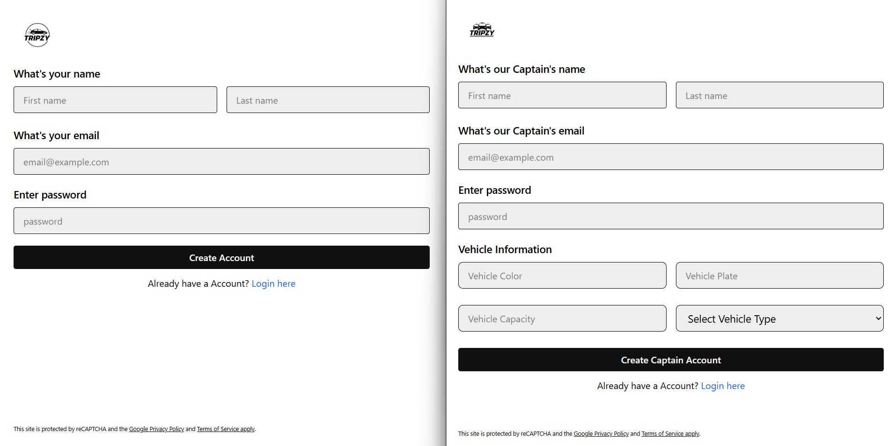
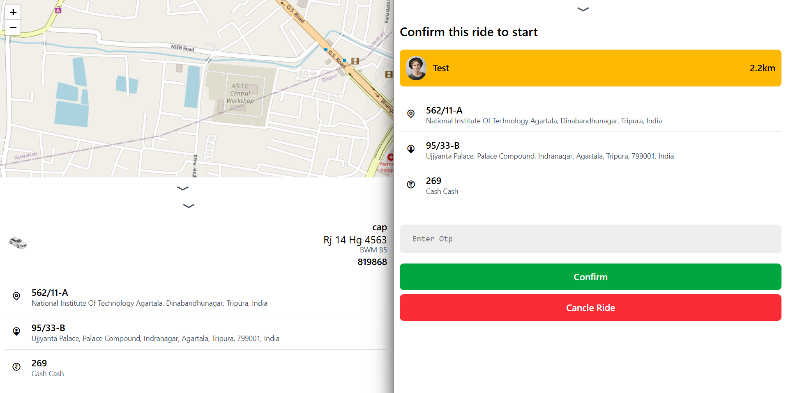
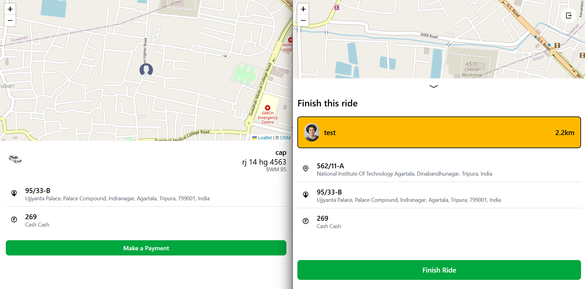

# Tripzy

**Tripzy is a full-stack Uber-like ride booking application built using the MERN stack (MongoDB, Express.js, React.js, Node.js) along with WebSockets (Socket.io) for real-time location updates and Leaflet for map rendering. It features separate modules for Users and Captains (drivers), OTP verification for ride confirmation, and live tracking. The app is deployed on Vercel with dedicated frontend and backend configurations.**


---

## Demo

* [*Tripzy*](https://hunta-taxi.vercel.app/) — https://hunta-taxi.vercel.app/

---

## Features

- 🔐 *User & Captain Authentication* – Sign up, log in, and maintain sessions securely.  
- 🚖 *Ride Booking* – Select pickup and destination with live suggestions.  
- 💸 *Dynamic Fare Calculation* – Different fares for auto, car, and moto.  
- 📍 *Real-Time Location Tracking* – Captains share live location, users see nearby captains.  
- 📡 *WebSocket Integration* – Live ride status & captain-user updates.  
- 🔢 *OTP Verification* – OTP required to start a ride for security.  
- 🔔 *Ride Notifications* – Captains notified of incoming ride requests.  
- 🗺 *Interactive Maps* – Leaflet + OpenStreetMap for geolocation and tracking.  
---

## 🛠 Tech Stack

| Category            | Technologies |
|---------------------|--------------|
| *Language*        |  |
| *Frontend*        |    |
| *Animations & Icons* |   |
| *Backend*         |   |
| *Database*        |  |
| *Real-Time*       |  |
| *Deployment*      |   |
| *Maps & Routing*  |   |
---

# Screenshots
<table>
  <tr>
    <th>Login Page</th>
    <th>Chat Page</th>
    <th>Update Page</th>
  </tr>
  <tr>
    <td align="center">
      
    </td>
    <td align="center">
      
    </td>
    <td align="center">
      
    </td>
  </tr>
</table>


## 📂 Project Structure

```text
Tripzy/
├── Backend/                     # Backend server
│   ├── src/
│   │   ├── controllers/         # Request handlers (business logic)
│   │   ├── db/                  # Database connection & configs
│   │   ├── middlewares/         # Middlewares (auth, validation, etc.)
│   │   ├── models/              # Mongoose models (User, Captain, Ride, etc.)
│   │   ├── routers/             # Express routes
│   │   └── services/            # Helper services (OTP, payment, etc.)
│   ├── app.js                   # Express app setup
│   ├── constant.js              # Project constants
│   ├── index.js                 # Entry point for backend
│   ├── socket.js                # Socket.io real-time events
│   ├── .env                     # Environment variables
│   ├── package.json             # Backend dependencies
│   ├── package-lock.json
│   ├── Procfile                 # Deployment config (Heroku)


├── Frontend/                    # Frontend application
│   ├── public/                  # Static assets
│   ├── src/                     # React source code
│   ├── .env                     # Frontend environment variables
│   ├── index.html               # Main HTML file
│   ├── package.json             # Frontend dependencies
│   ├── package-lock.json
│   ├── vite.config.js           # Vite config
│   ├── eslint.config.js         # ESLint rules
│   ├── README.md                # Frontend readme
│   ├── vercel.json              # Deployment config (Vercel)
│   └── .gitignore
│
├── .gitignore                   # Root ignore file

````

----

## 🚀 Getting Started

### 1. Clone repo
```bash
git clone https://github.com/SachinSihag1407/Tripzy.git
cd Tripzy
```

### 2. Backend Setup
```bash
cd Backend
npm install
```

This will install the following dependencies:

- **axios** → Ola API aur external APIs ko call karne ke liye  
- **bcrypt** → Password hashing (users & captains ke liye secure storage)  
- **cookie-parser** → Cookies ko parse karne ke liye (auth tokens, sessions)  
- **cors** → Cross-origin requests allow karne ke liye (frontend-backend connect)  
- **crypto** → OTP aur unique identifiers generate karne ke liye  
- **dotenv** → `.env` config load karne ke liye  
- **express** → Backend framework  
- **express-validator** → Input validation (form / API requests)  
- **jsonwebtoken** → JWT-based authentication (login/register)  
- **mongoose** → MongoDB ke saath interact karne ke liye  
- **socket.io** → Real-time communication (live location, ride updates)  

**Dev dependency:**  
- **nodemon** → Development me auto-restart for backend server  

Create `.env` file:
```
PORT=5000
MONGO_URI=mongodb+srv://<your_userName>:<your_password>@cluster0.mongodb.net/tripzy
JWT_SECRET=your_jwt_secret
```

Run backend:
```bash
npm start
```

### 3. Frontend Setup
```bash
cd Frontend
npm install
```
This will install the following dependencies:

- **axios** → Ola API aur external APIs ko call karne ke liye  
- **@gsap/react** → React ke saath GSAP animations use karne ke liye 
- **gsap** → Animations aur motion effects ke liye  
- **leaflet** → Maps render karne ke liye  
- **lucide-react** → React ke andar icons use karne ke liye 
- **react-router-dom** → Routing (pages navigate karne ke liye)  
- **remixicon** → Icon library 
- **socket.io-client** → Real-time communication (ride updates, live tracking)  

Create `.env` file:
```
VITE_API_URL=http://localhost:5000
```

Run frontend:
```bash
npm run dev
```

---

## 📡 Real-Time Flow

1. User books a ride → OTP generated.  
2. Captain receives request → accepts/rejects.  
3. OTP verified → ride starts.  
4. Captain’s live location updates via Socket.IO.  
5. Ride ends → trip recorded in DB.  

---

# 📖 Backend API Documentation

## `/users/register` Endpoint

### Description
Registers a new user by creating a user account with the provided information.

### HTTP Method
`POST`

### Request Body
```json
{
  "fullname": { "firstname": "John", "lastname": "Doe" },
  "email": "john@example.com",
  "password": "secret123"
}
```

### Example Response
```json
{
  "user": {
    "fullname": { "firstname": "John", "lastname": "Doe" },
    "email": "john@example.com"
  },
  "token": "jwt_token_here"
}
```

---

## `/users/login` Endpoint

### Description
Authenticates a user using their email and password, returning a JWT token upon successful login.

### HTTP Method
`POST`

### Request Body
```json
{
  "email": "john@example.com",
  "password": "secret123"
}
```

### Example Response
```json
{
  "user": {
    "fullname": { "firstname": "John", "lastname": "Doe" },
    "email": "john@example.com"
  },
  "token": "jwt_token_here"
}
```

---

## `/users/profile` Endpoint

### Description
Retrieves the profile information of the currently authenticated user.

### HTTP Method
`GET`

### Authentication
`Authorization: Bearer <token>`

### Example Response
```json
{
  "user": {
    "fullname": { "firstname": "John", "lastname": "Doe" },
    "email": "john@example.com"
  }
}
```

---

## `/users/logout` Endpoint

### Description
Logout the current user and blacklist the token provided in cookie or headers.

### HTTP Method
`GET`

### Authentication
`Authorization: Bearer <token>`

### Example Response
```json
{
  "message": "Logout successful"
}
```

---

## `/captains/register` Endpoint

### Description
Registers a new captain by creating a captain account with the provided information.

### HTTP Method
`POST`

### Request Body
```json
{
  "fullname": { "firstname": "Alex", "lastname": "Smith" },
  "email": "alex@example.com",
  "password": "captain123",
  "vehicle": {
    "color": "Red",
    "plate": "AB123CD",
    "capacity": 4,
    "vehicleType": "car"
  }
}
```

### Example Response
```json
{
  "captain": {
    "fullname": { "firstname": "Alex", "lastname": "Smith" },
    "email": "alex@example.com",
    "vehicle": {
      "color": "Red",
      "plate": "AB123CD",
      "capacity": 4,
      "vehicleType": "car"
    }
  },
  "token": "jwt_token_here"
}
```

---

## `/captains/login` Endpoint

### Description
Authenticates a captain using their email and password, returning a JWT token.

### HTTP Method
`POST`

### Request Body
```json
{
  "email": "alex@example.com",
  "password": "captain123"
}
```

### Example Response
```json
{
  "captain": {
    "fullname": { "firstname": "Alex", "lastname": "Smith" },
    "email": "alex@example.com"
  },
  "token": "jwt_token_here"
}
```

---

## `/maps/get-coordinates` Endpoint

### Description
Retrieves the coordinates (latitude and longitude) for a given address using **OpenStreetMap Nominatim API**.

### HTTP Method
`GET`

### Example Request
```
/maps/get-coordinates?address=Connaught+Place,+New+Delhi
```

### Example Response
```json
{
  "lat": 28.6315,
  "lng": 77.2167
}
```

---

## `/maps/get-distance-time` Endpoint

### Description
Retrieves the distance and estimated travel time between two locations using **OLA API**.

### HTTP Method
`GET`

### Example Request
```
/maps/get-distance-time?origin=28.6315,77.2167&destination=28.7041,77.1025
```

### Example Response
```json
{
  "distance": { "text": "15 km", "value": 15000 },
  "duration": { "text": "32 mins", "value": 1920 }
}
```

---

## `/rides/create` Endpoint

### Description
Creates a new ride with the provided information.

### HTTP Method
`POST`

### Authentication
`Authorization: Bearer <token>`

### Request Body
```json
{
  "pickup": "Connaught Place, New Delhi",
  "destination": "India Gate, New Delhi",
  "vehicleType": "car"
}
```

### Example Response
```json
{
  "ride": {
    "user": "userId123",
    "pickup": "Connaught Place, New Delhi",
    "destination": "India Gate, New Delhi",
    "fare": 200.0,
    "status": "pending",
    "otp": "1234"
  }
}
```

---

## `/rides/get-fare` Endpoint

### Description
Retrieves the fare estimate for a ride between the provided pickup and destination using **OLA API**.

### HTTP Method
`GET`

### Example Request
```
/rides/get-fare?pickup=28.6315,77.2167&destination=28.7041,77.1025
```

### Example Response
```json
{
  "auto": 120.0,
  "car": 200.0,
  "moto": 100.0
}
```

---

## 🤝 Contributing

1. Fork this repository.  
2. Create a new branch: `git checkout -b feature-name`.  
3. Commit changes: `git commit -m 'Add feature'`.  
4. Push: `git push origin feature-name`.  
5. Open a Pull Request.  

---

## 🙌 Acknowledgments
👨‍💻 [**Sachin Sihag**](https://github.com/SachinSihag1407)  

